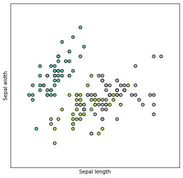

```python
import matplotlib.pyplot as plt
from sklearn import datasets
```

We begin by loading the `iris` dataset.


```python
iris = datasets.load_iris()
X = iris.data[:, :2]
y = iris.target

x_min, x_max = X[:, 0].min() - .5, X[:, 0].max() + .5
y_min, y_max = X[:, 1].min() - .5, X[:, 1].max() + .5
```

Below is a plot of the data, with the code used to generate it hidden.


```python
plt.figure(1, figsize=(6, 6))

plt.scatter(X[:, 0], X[:, 1], c=y, cmap=plt.cm.Set2,
            edgecolor='k')
plt.xlabel('Sepal length')
plt.ylabel('Sepal width')

plt.xlim(x_min, x_max)
plt.ylim(y_min, y_max)
plt.xticks(())
plt.yticks(())

plt.show()
```


    

    

