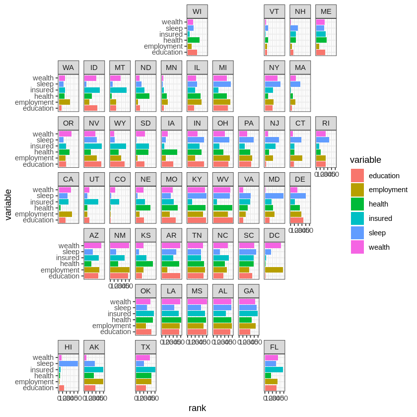

```R
library(ggplot2)
library(geofacet)
```

We begin by loading the `state_ranks` dataset.


```R
head(state_ranks)
```


<table>
<caption>A data.frame: 6 × 4</caption>
<thead>
	<tr><th></th><th scope=col>state</th><th scope=col>name</th><th scope=col>variable</th><th scope=col>rank</th></tr>
	<tr><th></th><th scope=col>&lt;chr&gt;</th><th scope=col>&lt;chr&gt;</th><th scope=col>&lt;chr&gt;</th><th scope=col>&lt;dbl&gt;</th></tr>
</thead>
<tbody>
	<tr><th scope=row>1</th><td>AK</td><td>Alaska</td><td>education </td><td>28</td></tr>
	<tr><th scope=row>2</th><td>AK</td><td>Alaska</td><td>employment</td><td>50</td></tr>
	<tr><th scope=row>3</th><td>AK</td><td>Alaska</td><td>health    </td><td>25</td></tr>
	<tr><th scope=row>4</th><td>AK</td><td>Alaska</td><td>wealth    </td><td> 5</td></tr>
	<tr><th scope=row>5</th><td>AK</td><td>Alaska</td><td>sleep     </td><td>27</td></tr>
	<tr><th scope=row>6</th><td>AK</td><td>Alaska</td><td>insured   </td><td>50</td></tr>
</tbody>
</table>


Below is a plot of the data, with the code used to generate it hidden.


    

    

